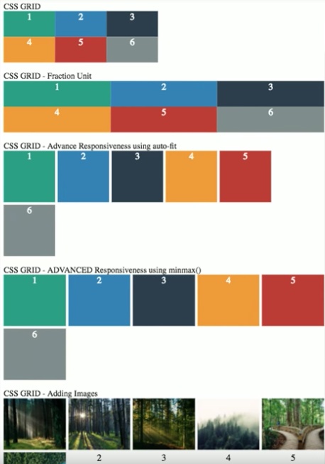

# css-grid
HTML responsive by adding a single line of CSS
 
 
 
CSS PROPERTIES USED FOR THIS EXAMPLE:

<code>display: grid;</code> 
<code>grid-template-columns: 100px 100px 100px;</code> 
<code>grid-template-rows: 50px 50px;</code> 
<code>grid-gap: 5px;</code> 

<code><h2>Video sample</h2></code>
